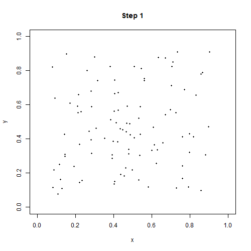

　　羊群效应可以使用计算机编程进行模拟。计算机编程提供了一种有效的方法来研究羊群效应，并通过仿真和实验等手段来理解这种现象。在计算机编程中，可以采用基于智能体的建模方法，将每个个体（或智能体）视为一个参与者，通过规则、策略和交互行为等方式来模拟羊群效应的形成和演化过程。可以使用各种编程语言和模拟工具来构建模型，如MATLAB、Python、NetLogo等。

　　例如，在NetLogo中，可以使用随机游走模型或其他基于邻居互动和信息传递的模型来模拟羊群效应。通过对初始状态、邻域半径、羊群密度、移动速度等参数进行调整，观察运行结果，可以更好地理解羊群效应的形成和特征，并进一步探讨其中的规律和影响因素。

　　在R语言中，可以使用基于智能体的建模框架（如Agent-Based Modeling, ABM）来模拟羊群效应。这种方法将每个参与者视为一个智能体，并定义其行为规则和相互作用方式，从而模拟整个群体的运动和演化过程。以下是一个简单的R代码示例：
```{r results='hide'}
library(animation)

# 设定模型参数
n <- 100 # 羊群大小
steps <- 200 # 模拟步数
radius <- 10 # 邻域搜索半径
speed <- 0.1 # 移动速度

# 定义初始位置
x <- runif(n)
y <- runif(n)

# 创建动画保存函数
saveAnim <- function() {
  for (i in 1:steps) {
    for (j in 1:n) {
      # 计算每个羊的邻居
      neighbors <- which(sqrt((x-x[j])^2 + (y-y[j])^2) < radius & (x-x[j])^2 + (y-y[j])^2 > 0)

      # 更新羊的位置
      if (length(neighbors) > 0) {
        cx <- mean(x[neighbors])
        cy <- mean(y[neighbors])
        dx <- cx - x[j]
        dy <- cy - y[j]
        len <- sqrt(dx^2 + dy^2)
        x[j] <- x[j] + speed * dx / len
        y[j] <- y[j] + speed * dy / len
      }
    }
  
    # 可视化羊群位置并保存为gif
    plot(x, y, xlim=c(0,1), ylim=c(0,1), pch=19, cex=0.5)
    title(paste("Step", i))
    ani.pause()
    ani.record()
  }
}

# 输出动态图
saveGIF(saveAnim(), interval = 0.1, ani.width = 500, ani.height = 500)
```


　　在R语言中，实现ABM需要使用特定的软件包或库。以下是一些常用的ABM软件包：

NetLogoR：NetLogoR是一个为基于智能体的建模提供支持的软件包，它支持多代理模拟、空间建模和数据可视化等功能。

Repast：Repast是另一个流行的ABM工具，它提供了一种灵活且可扩展的建模环境，使用户可以根据自己的需求进行自定义。

Mason：Mason是一个用Java编写的开源ABM库，提供了一个易于使用的框架，可以在其中构建复杂的交互式模拟。

无论使用哪个软件包，ABM的实现过程通常包括以下步骤：
1. 定义系统中的智能体，并指定其属性和行为规则。
1. 构建一个仿真环境（包括任何必要的空间、地图等），并将智能体放置在其中。
1. 模拟智能体之间的相互作用和决策，例如通过随机游走、交流信息或调整行为规则来更新每个智能体的状态。
1. 收集并分析仿真结果，并对模型进行修改和优化，以更好地反映真实系统。
