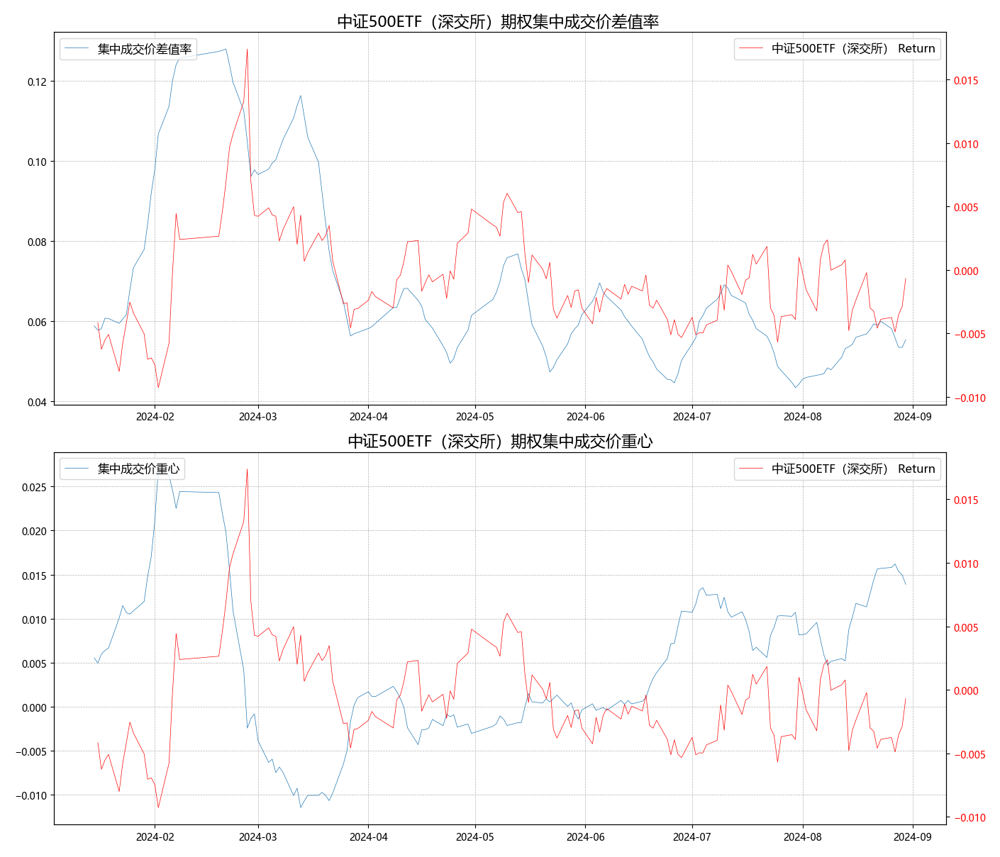
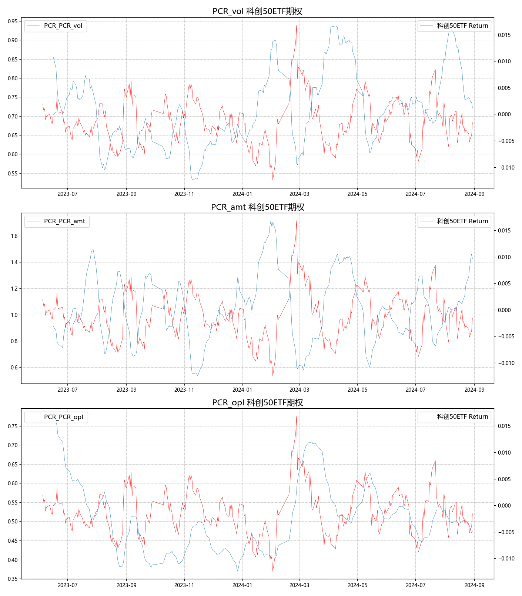

# 期权市场的交易信息可以反映现货市场的情绪

因为：

* 多空方向的情绪博弈：期权拥有4个方向的交易，反应多空方向情绪

* 不同期限反应情绪时间段：期权合约拥有多个到期月份，可以细化不同时间段情绪

* 不同执行价的情绪强弱：投资者对不同执行价期权的选择，反应市场的情绪强弱

* 期权隐波率反应未来预期：根据B-S定价公式，由市场定价的期权价格隐含的波动率反应投资者对未来市场的整体预期

* 细分不同参与类别情绪：机构与个人投资者参与期权交易方式不同，细化情绪

# 期权PCR指标：成交量PCR追踪市场走势

   - PCR指标，即期权认购量（Call）与认沽量（Put）之比，是衡量市场情绪和投资者对未来市场走势预期的重要指标。
   - 持仓量PCR与成交额PCR是PCR指标的两个重要维度，分别反映了市场投资者对未来市场反转的担忧程度（持仓量PCR）和看跌期权与看涨期权上的资金消耗比例（成交额PCR）。

1. **成交量PCR**追踪市场走势：
   - 成交量PCR通常作为反映期权市场投资者情绪的指标在使用，成交量PCR更多的反映期权投资者追涨追跌的情绪
   - 标的持续上涨时，往往伴随着成交量PCR的走弱；标的持续下跌时，成交PCR又会走强


2. **持仓量PCR**反映市场担忧程度：
   - **较高持仓量PCR**：当持仓量PCR较高时，代表投资者对未来标的反转下跌的担忧较为强烈，这通常发生在市场处于上升趋势中，投资者通过持有认沽期权来对冲潜在的市场下跌风险。
   - **较低持仓量PCR**：相反，当持仓量PCR较低时，可能表明投资者正在提前布局认购期权，预期市场将继续上涨或已经处于下跌趋势中，投资者通过持有认购期权来捕捉市场上涨的机会。
   - **波动性**：持仓量PCR的波动较大且分散，没有相对稳定的均值，特别是在均值以上的数据波动更为显著。

3. **成交额PCR**细化投资者行为：
   - **定义**：成交额PCR反映的是看跌期权上消耗的资金与看涨期权上消耗的资金的比值，能够更细致地刻画市场主力的交易行为。
   - **市场主力与极端投机者**：相比成交量PCR，成交额PCR更能反映市场主力的选择倾向，因为它过滤掉了极端投机者在深度虚值期权上的“赌博”行为。市场主力通常更倾向于交易平值附近的期权。
   - **资金消耗视角**：成交额PCR通过资金消耗的角度，提供了对市场情绪和投资者行为的另一重解读，有助于更全面地理解市场动态。

# 期权价格指标：反映市场的分歧度和多空力量强弱

```{python eval=FALSE, include=FALSE}
import pandas as pd
from iFinDPy import *
from tqdm import tqdm
from datetime import datetime, time, timedelta  
import matplotlib.pyplot as plt
import matplotlib as mpl
mpl.rcParams['font.sans-serif']=['Microsoft Yahei']
import os
import docx
from docx import Document  
from docx.shared import Inches
from docx.enum.section import WD_ORIENTATION, WD_SECTION_START
from docx.oxml.ns import qn

import warnings
def processing_raw_data(df):
    
    aggregated_df = df.groupby('time')[['volume', 'amount', 'openInterest']].sum().reset_index()  

    aggregated_df['time'] = pd.to_datetime(aggregated_df['time'])
    aggregated_df = aggregated_df.set_index('time').sort_index()  
    
    return aggregated_df 

def get_daily_PCR(call_df,put_df):

    if not call_df.index.equals(put_df.index):  
        raise ValueError("The index of the call and put are not aligned.")

    
    res_df = pd.DataFrame(index = call_df.index)

    res_df['PCR_vol'] = put_df['volume'] / call_df['volume']
    res_df['PCR_amt'] = put_df['amount'] / call_df['amount']
    res_df['PCR_opI'] = put_df['openInterest'] / call_df['openInterest']

    return res_df
  
def get_PCR_series(history_data):
    call_df = processing_raw_data(history_data[history_data['Signal'] == 'c'])
    put_df = processing_raw_data(history_data[history_data['Signal'] == 'p'])

    result = get_daily_PCR(call_df,put_df)
    return result
  
def weighted_avg_price(single_df):  
    
    single_df.set_index('time', inplace=True)  
    weighted_sum = (single_df['strikePrice'] * single_df['volume']).groupby(level=0).transform(sum)   
    total_volume = single_df['volume'].groupby(level=0).transform(sum)  
    result = (weighted_sum / total_volume).drop_duplicates()
    return result
  
def get_dbtp_cgtp(raw_data,udly_df):
    
    call_df = raw_data[raw_data['Signal'] == 'c']
    put_df = raw_data[raw_data['Signal'] == 'p']
    wap_call = weighted_avg_price(call_df)
    wap_put = weighted_avg_price(put_df)

    result_df = pd.DataFrame({'wap_call':wap_call,'wap_put':wap_put})
    result_df.index = pd.to_datetime(result_df.index)

    udly_df = udly_df.set_index('time')
    udly_df.index = pd.to_datetime(udly_df.index)

    
    result_df = result_df.join(udly_df['close']).sort_index()
    dbtp = (result_df['wap_call']-result_df['wap_put']) / result_df['close']
    cgtp = ((result_df['wap_call']+result_df['wap_put'])/2 - result_df['close']) / result_df['close']

    res = pd.DataFrame({'dbtp':dbtp,'cgtp':cgtp},index=result_df.index)
    return res
  
def calculate_rank_normalized(df):
    
    numeric_df = df.select_dtypes(include='number')
    
    ranked_df = numeric_df.rank(method='min', ascending=True) / len(df)
    
    non_numeric_df = df.select_dtypes(exclude='number')
    if not non_numeric_df.empty:
        result_df = pd.concat([ranked_df, non_numeric_df], axis=1)
    else:
        result_df = ranked_df
    
    return result_df
  
def rolling_average(df, window):
    
    if not isinstance(window, int) or window <= 0:
        raise ValueError("窗口大小window必须是一个正整数")

    rolling_df = df.rolling(window=window).mean()
    
    return rolling_df

def main_report(target_name,REPORT_START = None,rolling_window = 10,SHOW_RESULT = True):

    target_dict = {'510050.SH':'上证50ETF',
              '510300.SH':'沪深300ETF（上交所）',
              '510500.SH':'中证500ETF（上交所）',
              '588000.SH':'科创50ETF',
              '588080.SH':'科创板50ETF',
              '159901.SZ':'深证100ETF',
              '159915.SZ':'创业板ETF',
              '159919.SZ':'沪深300ETF（深交所）',
              '159922.SZ':'中证500ETF（深交所）',
              '000016.SH':'上证50',
              '000300.SH':'沪深300',
              '000852.SH':'中证1000'}
    
    history_data = pd.read_csv(f'D:/study/jupyterlab/国海/期权/All/data/option_history_data_{target_name}.csv')
    target_data = pd.read_csv(f'D:/study/jupyterlab/国海/期权/All/data/target_history_data_{target_name}.csv')
    
    if REPORT_START: # 2024年起的数据
        history_data = history_data.set_index('time')
        history_data.index = pd.to_datetime(history_data.index)
        history_data = history_data.loc[REPORT_START:]
        history_data = history_data.reset_index()
        
        target_data = target_data.set_index('time')
        target_data.index = pd.to_datetime(target_data.index)
        target_data = target_data.loc[REPORT_START:]
        target_data = target_data.reset_index()
        
    PCR = get_PCR_series(history_data)
    dbtp_cgtp = get_dbtp_cgtp(history_data,target_data)
    PCR_rolling = rolling_average(PCR,rolling_window)
    dbtp_cgtp_rolling = rolling_average(dbtp_cgtp,rolling_window)

    target_data = target_data.set_index('time')
    target_data.index = pd.to_datetime(target_data.index)
    target_rolling = rolling_average(target_data,rolling_window)
    target_rate = rolling_average(target_data['close'].pct_change(),rolling_window)
    
    PCR_table = calculate_rank_normalized(PCR)
    DBTP_CGTP_table = calculate_rank_normalized(dbtp_cgtp)

    if SHOW_RESULT:
        display(PCR_table.tail(20).style.format('{:.2%}'))
    
    fig0, axes = plt.subplots(nrows=3, ncols=1, figsize=(14, 16))

    target_rate1 = target_rate.reindex(PCR_rolling.index, fill_value=None)
    
    for i, ax in enumerate(axes):
        
        ax.plot(PCR_rolling.index, PCR_rolling.iloc[:, i], label=f'PCR_{PCR_rolling.columns[i]} ', linewidth=0.5)
        ax.set_title(f'{PCR_rolling.columns[i]} {target_dict[target_name]}期权', fontsize=16)
        ax.grid(True, which="both", linestyle='--', linewidth=0.5)
        ax.legend(loc='upper left', fontsize=12)  

        ax2 = ax.twinx()
        ax2.plot(target_rate1.index, target_rate1, color='red', label=f'{target_dict[target_name]} Return', linewidth=0.5)
        ax2.legend(loc='upper right', fontsize=12) 

        # ax2.set_ylabel('SZ50ETF Close Price', color='red')
        # ax2.tick_params('y', colors='red')

    plt.tight_layout()
    if SHOW_RESULT:
        plt.show()
    if SHOW_RESULT:
        display(DBTP_CGTP_table.tail(20).style.format('{:.2%}'))
    
    fig1, axes = plt.subplots(nrows=2, ncols=1, figsize=(14, 12))

    target_rate2 = target_rate.reindex(dbtp_cgtp_rolling.index, fill_value=None)    

    axes[0].plot(dbtp_cgtp_rolling.index, dbtp_cgtp_rolling['dbtp'], label='集中成交价差值率', linewidth=0.5)
    axes[0].set_title(f'{target_dict[target_name]}期权集中成交价差值率 ', fontsize=16)
    axes[0].grid(True, which="both", linestyle='--', linewidth=0.5)

    ax2_0 = axes[0].twinx()
    ax2_0.plot(target_rate2.index, target_rate2, color='red', label=f'{target_dict[target_name]} Return', linewidth=0.5)
    # ax2_0.set_ylabel('SZ50ETF Close Price', color='red')
    ax2_0.tick_params(axis='y', labelcolor='red')
    axes[0].legend(loc='upper left', fontsize=12)
    ax2_0.legend(loc='upper right', fontsize=12)

    axes[1].plot(dbtp_cgtp_rolling.index, dbtp_cgtp_rolling['cgtp'], label='集中成交价重心', linewidth=0.5)
    axes[1].set_title(f'{target_dict[target_name]}期权集中成交价重心', fontsize=16)
    axes[1].grid(True, which="both", linestyle='--', linewidth=0.5)

    ax2_1 = axes[1].twinx()
    ax2_1.plot(target_rate2.index, target_rate2, color='red', label=f'{target_dict[target_name]} Return', linewidth=0.5)
    # ax2_1.set_ylabel('SZ50ETF Close Price', color='red')
    ax2_1.tick_params(axis='y', labelcolor='red')
    axes[1].legend(loc='upper left', fontsize=12)
    ax2_1.legend(loc='upper right', fontsize=12)

    plt.tight_layout()
    if SHOW_RESULT:
        plt.show()

    # PCR_table = PCR_table.add_suffix(f'_{target_dict[target_name]}')
    # DBTP_CGTP_table = DBTP_CGTP_table.add_suffix(f'_{target_dict[target_name]}')
    # return PCR_table,DBTP_CGTP_table
    return None
```


```{python eval=FALSE, include=FALSE, result='asis'}
target_dict = {'510050.SH':'上证50ETF',
              '510300.SH':'沪深300ETF（上交所）',
              '510500.SH':'中证500ETF（上交所）',
              '588000.SH':'科创50ETF',
              '588080.SH':'科创板50ETF',
              '159901.SZ':'深证100ETF',
              '159915.SZ':'创业板ETF',
              '159919.SZ':'沪深300ETF（深交所）',
              '159922.SZ':'中证500ETF（深交所）',
              '000016.SH':'上证50',
              '000300.SH':'沪深300',
              '000852.SH':'中证1000'}

# PCR_All = []
# PCR_LOC = []
# 
# DC_All = []
# DC_LOC = []

for key in target_dict.keys():
    print('+'*100)
    print(f'标的{target_dict[key]}')
    
    main_report(key,SHOW_RESULT = False)
    # PCR_All.append(pcr)
    # DC_All.append(dc)

    
    print('*'*100)
    main_report(key,REPORT_START='2024-01-01',SHOW_RESULT = False)
    # PCR_LOC.append(pcr_l)
    # DC_LOC.append(dc_l)
```


```{r echo=FALSE, results='asis'}  
library(knitr)  
image_folder_path <- "figures/"  
image_files <- list.files(path = image_folder_path, pattern = "\\.png$|\\.jpg$", full.names = TRUE)


include_graphics('figures/000300.SH_DBTP_CGTP2024-01-01.png')





include_graphics('figures/159922.SZ_PCRNone.png')


include_graphics('figures/510300.SH_DBTP_CGTP2024-01-01.png')


include_graphics('figures/510500.SH_PCR2024-01-01.png')





include_graphics('figures/588080.SH_PCRNone.png')
```


